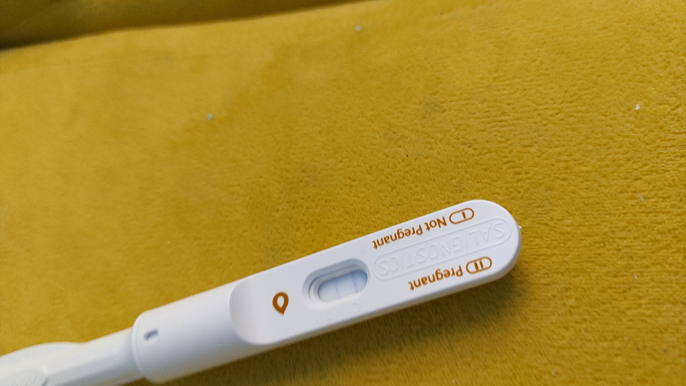

# Diagnotsitc Stick Calssifier

This repositoty contain an end to end application
that receive image of detection stick, and return Positve/Negative status for the detection.

## Three Steps Model

A - Object detection:  Locate the stick and the exact window were markers are expected. Then
aligning the window, so that it is directed horizontally.

B - Markers Detection - Running pattern match algorithms to enhance pixels were it might be a marker.

C - Classification - Given the map of the potential markers, and their intensity,\
classifying the test to be positive or negative. 

# Visual example
|                 | Positive                                                        | Negative                                                         |
|-----------------|-----------------------------------------------------------------|------------------------------------------------------------------|
| source          |  |   |
| alligned window |  |   |
| markers         |  |  |
|model response   | Positive, confidence = 1.0                                      | Negative, confidence = 0.92 | 

## installation and usage
 Please follow instructions in INSTALL.md 
